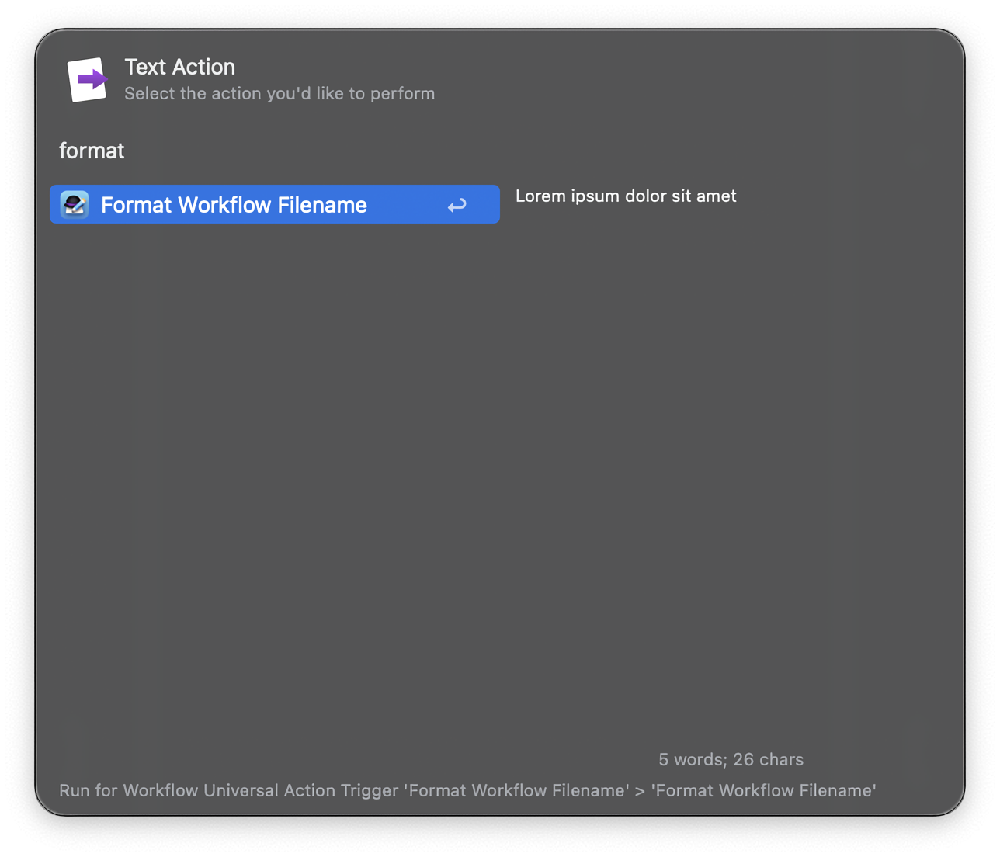

#  Format Workflow Filename | Alfred Workflow

Standardize and optimize your Alfred workflow names by automatically applying the kebab-text format on export, ready to share with the community.

## Download

- Download it directly [from GitHub here](https://github.com/vanstrouble/).

## Usage

Select text, and via Universal Action.

